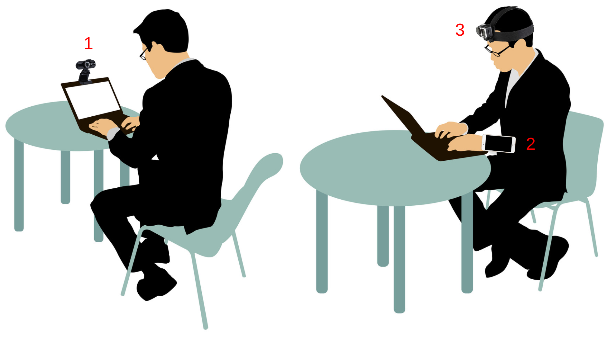

# 2021-ExamMonitoringSystem

    

## Mobile App

    <kbd>
        
    </kbd>

## Requirements
For python, all requirements can be found in the `requirements.txt` file.

> pip install requirements.txt

For the mobile application, take a look at the Gradle files.

## Contribute
Please feel free to report any bug that you encounter while using the system. You have solely to create a new issue in the `Issues` tab.
Feel free also to provide suggestions for improvement or additional features that you want to see in the system. Again, simply create a new issue.

## Credits
* Massinissa HAMIDI (hamidi@lipn.univ-paris13.fr)
* an original idea of Aomar Osmani (ao@lipn.univ-paris13.fr)
* all students who will contribute for the improvement of the system

## License
