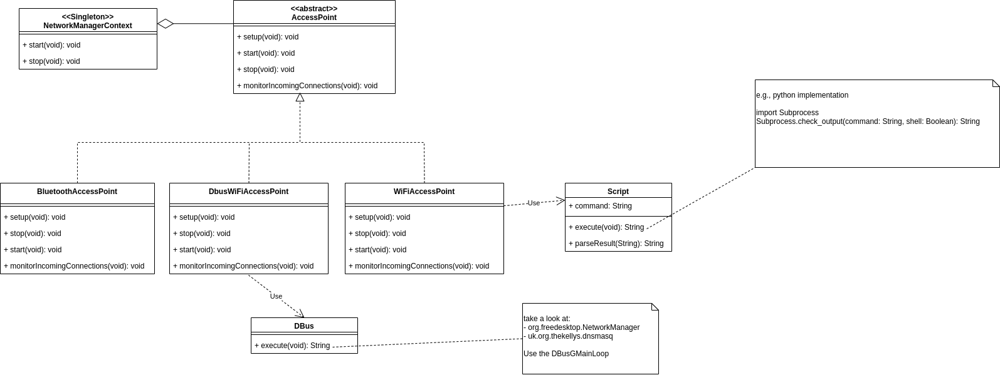

# Network Package

This package handles the networking of the system. It features a network manager which setups and controls an access point. The access point creates a wireless local network and waits for incoming connections. For now, the implementation uses ad-hoc strategies which are tightly coupled to unix systems.

## Sequence diagram
The following sequence diagram shows how the connection is triggered from the application installed on a smartphone.

    

## Class diagram

    

