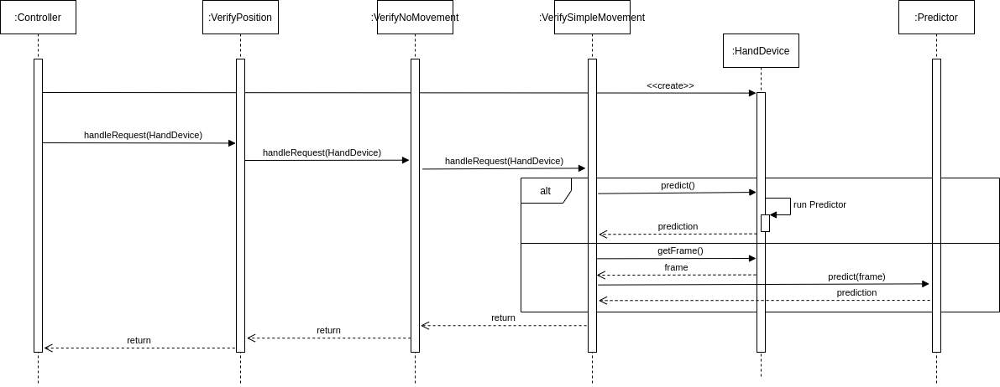
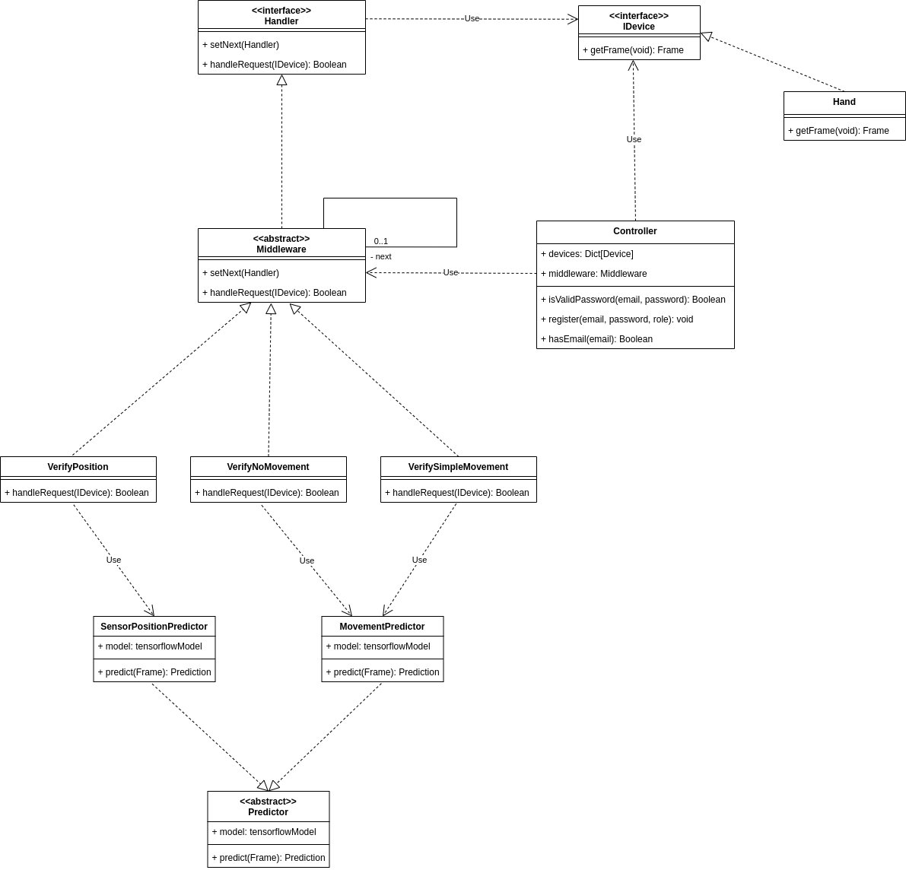

# SystemSetup Package

This package contains the necessary classes for system setup.

System setup is the process of taking a newly connected smartphone and perform in it different verfications, including:
* verify if a similar device is already registered,  e.g. hand device registered twice;
* calibrate the machine learning models according to the specificities of the newly connected device and of its sensors;
* verify if we can trust the newly connected device, e.g. you can think of a certification system that allows only a certain kind of devices;
* etc.

## Sequence diagram

    

## Class diagram

    

